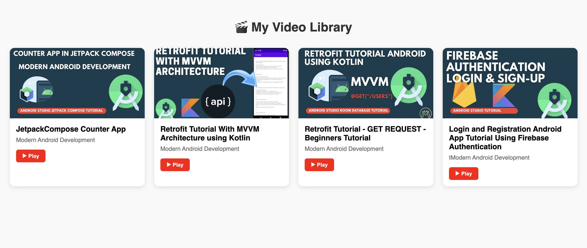

# youtube-stream-microservice

components:

- ✅ API Gateway
- ✅ Config Server
- ✅ Service Registry (Eureka)
- ✅ Movie Catalog Service
- ✅ Movie Streaming Service
- ✅ Zipkin for tracing
- ✅ MySQL for persistence

---

### 📄 `README.md`

```markdown
# 🎬 Movie Microservices Architecture

This is a microservices-based application designed to simulate a **movie streaming platform** using Spring Boot, Spring Cloud, Eureka, and Zipkin. It demonstrates service discovery, distributed configuration, centralized logging, API routing, and distributed tracing.

---

## 🧱 Architecture Overview
```

```
                   +---------------------+
                   |    Config Server    |
                   +----------+----------+
                              |
     +------------------------v--------------------------+
     |                  Service Registry (Eureka)        |
     +------------------------+--------------------------+
                              |
 +----------------------------+-----------------------------+
 |                            |                             |
```

+----v----+ +-------v--------+ +-------v--------+
\| Gateway| | Movie Catalog | | Movie Streaming|
\| (Zuul) | | Service | | Service |
+----+----+ +-------+--------+ +-------+--------+
\| | |
+----------------------------+-----------------------------+
|
+-------v--------+
\| MySQL |
+----------------+

```
                      +----------------+
                      |    Zipkin      |
                      +----------------+
```

````

---

## 🧩 Services Description

| Service              | Port | Description                                                |
|----------------------|------|------------------------------------------------------------|
| 📘 Config Server      | 8888 | Centralized external configuration for all services       |
| 🧭 Eureka Server      | 8761 | Service discovery and registration center                 |
| 🚪 API Gateway        | 8080 | Routes client requests to appropriate microservices       |
| 🎥 Movie Catalog      | 8081 | Manages movie metadata (name, genre, rating, etc.)       |
| 📺 Movie Streaming    | 8082 | Manages streaming logic and availability                  |
| 📊 Zipkin             | 9411 | Distributed tracing visualization                         |
| 🗃️ MySQL              | 3306 | Database for persistent movie data                        |

---

## ⚙️ How to Run

> ✅ Prerequisite: Docker (for Zipkin & MySQL), Java 24+, Maven

### 1. Clone the Repo

```bash
git clone https://github.com/mullatoes/youtube-stream-microservice.git
cd youtube-stream-microservice
````

### 2. Start Zipkin & MySQL

```bash
# Start Zipkin
docker run -d -p 9411:9411 openzipkin/zipkin

# Start MySQL
docker run -d \
  --name mysql-movie-db \
  -e MYSQL_ROOT_PASSWORD=root \
  -e MYSQL_DATABASE=movies_db \
  -p 3306:3306 \
  mysql:8
```

### 3. Start the Services (in this order)

1. **Service Registry**
2. **Config Server**
3. **API Gateway**
4. **Movie Catalog Service**
5. **Movie Streaming Service**

Each module is a Spring Boot project. Run each with:

```bash
mvn spring-boot:run
```

Make sure the services read from `http://localhost:8888` for configs and register with Eureka at `http://localhost:8761`.

All requests go through `http:localhost:8000`

---

## 📸 Screenshots

### 🎬 Eureka Server Registry


### 📈 Zipkin Traces


### 📈 Zipkin Traces Expanded


### 🎞️ Movie Catalog UI




## 🔍 Distributed Tracing (Zipkin)

- Visit: [http://localhost:9411](http://localhost:9411)
- You’ll see end-to-end traces of requests as they pass through the gateway and services.
- Powered by **Spring Cloud Sleuth** + **Zipkin**

---

## 🧪 Sample Endpoints

- **List Movies:** `GET http://localhost:8000/movie-info/list-all`
- **Stream Movie:** `GET http://localhost:8000/movie-stream/play-with-id/{movieId}`
- **Eureka Dashboard:** [http://localhost:8761](http://localhost:8761)

---

## 📁 Project Modules

| Module Name               | Path                       |
| ------------------------- | -------------------------- |
| Config Server             | `/config-server`           |
| Service Registry (Eureka) | `/service-registry`        |
| API Gateway               | `/api-gateway`             |
| Movie Catalog Service     | `/movie-catalog-service`   |
| Movie Streaming Service   | `/movie-streaming-service` |

---

## 🧠 Tech Stack

- Spring Boot
- Spring Cloud Config
- Spring Cloud Netflix Eureka
- Spring Cloud Gateway
- Spring Cloud Sleuth
- Zipkin
- MySQL
- Docker

---

## 🧑‍💻 Author

Built by Kevin Kyei (mullatoes) (https://github.com/mullatoes) — Powered by ☕, 🎧, and 🍿

---

## 🛡️ License

This project is licensed under the MIT License.

```

```
